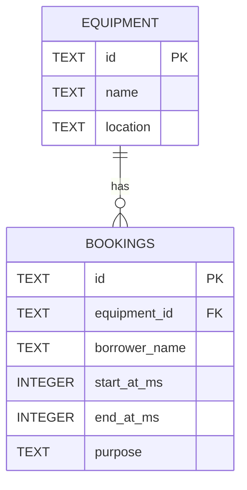

# Data Model and Business Rules

## Relationship

One equipment record can have zero or many bookings. Each booking references exactly one existing equipment record.



## Prepared SQLite/D1 schema

The executable definition is in [schema.sql](schema.sql); apply it before [seed.sql](seed.sql). It creates both tables, primary/foreign keys, field constraints, a time index, and insert/update overlap triggers. It has passed offline SQLite checks but has not been applied to the instructor's API database.

| Constraint | Database behavior |
|---|---|
| Primary keys | Non-null text IDs, 1–100 characters after trimming |
| Equipment name/location | Non-null, non-empty text |
| Equipment foreign key | Booking references existing equipment; referenced equipment cannot be deleted or have its ID changed |
| Borrower name | Non-null, 1–100 characters after trimming |
| Purpose | Non-null, 1–500 characters after trimming |
| Times | Stored values must be integer milliseconds; start is strictly before end |
| Overlap | INSERT/UPDATE triggers reject conflicting intervals for the same equipment |

`IF NOT EXISTS` makes repeated initialization safe for this schema; it does not alter a pre-existing incompatible table. Use the starter's migration conventions when it arrives.

Enable `PRAGMA foreign_keys = ON` on every ordinary SQLite connection before writes. This is connection setup, not a one-time schema setting. D1 already enforces foreign keys and does not let queries disable them; see [Cloudflare's foreign-key documentation](https://developers.cloudflare.com/d1/sql-api/foreign-keys/). Equipment deletion remains outside the API scope.

Store validated timestamps as UTC epoch milliseconds. Numeric comparison avoids errors from different textual timezone offsets. Convert database fields to API camelCase and return times through canonical UTC ISO serialization. Client input supplies neither table names nor column names.

## Seed records

| ID | Name | Location |
|---|---|---|
| `eq-1` | Projector A | Building 1 |
| `eq-2` | Camera A | Media Lab |

[seed.sql](seed.sql) uses `ON CONFLICT(id) DO NOTHING`: repeating it does not duplicate IDs or overwrite existing equipment. It inserts no bookings so the HTTP fixtures can start with an empty booking list.

## Parameterized overlap query

For creation, bind equipment ID, proposed end, and proposed start in that order:

```sql
SELECT id
FROM bookings
WHERE equipment_id = ?
  AND start_at_ms < ?
  AND end_at_ms > ?
LIMIT 1;
```

For an update, exclude the target booking and bind its ID as the fourth value:

```sql
SELECT id
FROM bookings
WHERE equipment_id = ?
  AND start_at_ms < ?
  AND end_at_ms > ?
  AND id <> ?
LIMIT 1;
```

All read and write statements must bind request values. For PATCH, build the complete validated record and use a fixed UPDATE statement, avoiding user-derived SQL column names.

## Write integrity

A standalone conflict SELECT followed by a write can admit overlapping bookings if requests interleave. [schema.sql](schema.sql) includes `bookings_prevent_overlap_insert` and `bookings_prevent_overlap_update`. They enforce the same overlap predicate and raise `booking_time_conflict`. The update trigger excludes `OLD.id`, identifying the stored booking itself even if direct SQL changes its ID; the API will not accept ID edits.

The trigger checks overlap only for correctly ordered intervals, leaving equal/reversed times to the time CHECK. `RAISE(ABORT, ...)` rejects the statement and provides the marker to the application; see [SQLite's trigger documentation](https://www.sqlite.org/lang_createtrigger.html). API handlers must map the known conflict marker to `409` and return safe errors for other failures. Do not map every database constraint failure to a conflict.

The schema uses SQLite SQL consistent with D1's documented [SQL compatibility](https://developers.cloudflare.com/d1/sql-api/sql-statements/). Actual import and adapter error behavior must still be verified in the instructor starter.

App-level validation and conflict queries provide readable errors; database enforcement protects the write itself. Do not claim concurrent-write protection is verified until its test is executed.

## Offline verification

Run `node .\scripts\verify-preparation.mjs` from the project folder. On the checked local environment, 19 checks passed using Node v24.18.1 / SQLite 3.53.1. These cover repeated initialization, constraints, overlap boundaries, self-updates, rejected-write preservation, parameter binding, deletion, and fixture syntax. The disposable in-memory database is closed after the run. Separate live HTTP tests now verify the local API, concurrent overlapping requests to one server, and file-backed persistence; see TEST_EVIDENCE. D1 integration and multiple server processes remain untested.

## Boundaries to explain and test

- Equal start and end is invalid (`400`).
- Partial overlap, containment, and identical intervals conflict (`409`).
- End-to-start adjacency is allowed.
- The same interval for different equipment is allowed.
- Updating a booking to its own unchanged interval succeeds.
- Changing equipment or times checks the merged booking against other records.
